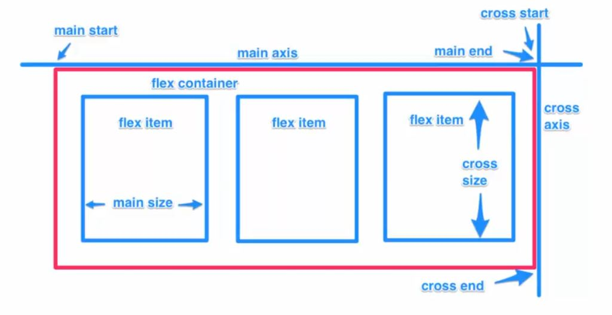

# Learn basic of CSS

- Not a programming language but a styling language.

- Can be extended with Lass/Sass

- If multiple style given for an element bottom most or last style is applies

- **box-sizing:border-box** (Consider padding and border inside width and height of box itself)

- Positioning
  - Static
  - Relative
  - Absolute
  - Fixed
  - Initial
  - Inherit

- These properties will not work unless the position property is set first

## Flexbox

- A CSS3 layout that that provide an easy and clean way to arrange items within a container.

- Order of elements can be easily changed without editing the source HTML.

- No Floats.

    

**Source : Brad Traversy YouTube Channel**
